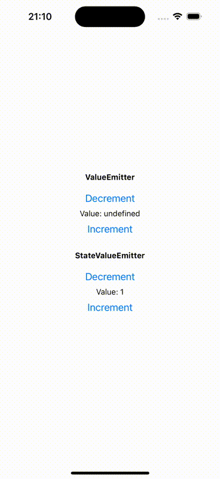

# react-native-value-emitter

This package provides two types of value emitters, with or without state.



**ValueEmitter** is based on React Native's EventEmitter and published strongly
typed values that can be listened to by an app.

**StateValueEmitter** is built on top of **ValueEmitter** and adds state persistency
so that the current value can always be queried.

**useValueEmitter** is a commodity hook that automatically subscribes to the emitter
and cancels the subscription when the component is unmounted.

## Installation

```sh
npm install react-native-value-emitter
```

## Usage

```js
import { StateValueEmitter, ValueEmitter, useValueEmitter, } from 'react-native-value-emitter';

// Create a value emitter with or without state
const valueEmitter = new ValueEmitter<number>();
const valueEmitter = new StateValueEmitter<number>(1);

// Listen to the value emitter
const [value, setValue] = useState<number>();

useValueEmitter((v) => {
  setValue(v);
}, valueEmitter);
```


## Contributing

See the [contributing guide](CONTRIBUTING.md) to learn how to contribute to the repository and the development workflow.

## License

MIT

---

Made with [create-react-native-library](https://github.com/callstack/react-native-builder-bob)
