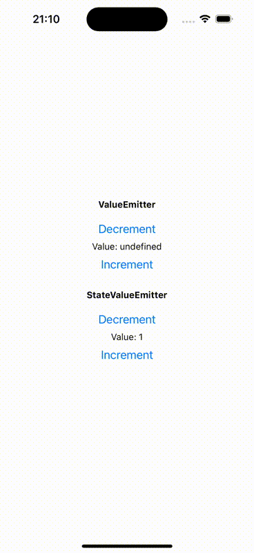

# react-native-value-emitter

[](https://www.npmjs.com/package/react-native-value-emitter)
[](./LICENSE)

Strongly typed value emitters for React Native, with a hook to subscribe to them from your components.



## Features

- **`ValueEmitter<T>`** — a strongly typed emitter built on React Native's `EventEmitter`.
- **`StateValueEmitter<T>`** — a `ValueEmitter` that also keeps track of its current value, and replays it to new subscribers.
- **`useValueEmitter`** — a hook that subscribes to an emitter and automatically unsubscribes when the component unmounts.

## Installation

```sh
npm install react-native-value-emitter
```

## Usage

### ValueEmitter

Emits values to listeners, without keeping any state.

```ts
import { ValueEmitter } from 'react-native-value-emitter';

const valueEmitter = new ValueEmitter<number>();

const subscription = valueEmitter.onValue((value) => {
  console.log(value);
});

valueEmitter.add(1);

subscription.remove();
```

### StateValueEmitter

Like `ValueEmitter`, but keeps the last emitted value around. New subscribers are immediately called with the current value, and it can be read at any time via `.value`.

```ts
import { StateValueEmitter } from 'react-native-value-emitter';

const stateValueEmitter = new StateValueEmitter<number>(1);

stateValueEmitter.onValue((value) => {
  console.log(value); // called immediately with 1
});

stateValueEmitter.add(2);

console.log(stateValueEmitter.value); // 2
```

### useValueEmitter

Subscribes a component to an emitter for the lifetime of the component.

```tsx
import { useState } from 'react';
import { StateValueEmitter, useValueEmitter } from 'react-native-value-emitter';

const counter = new StateValueEmitter<number>(0);

function Counter() {
  const [value, setValue] = useState(counter.value);

  useValueEmitter(setValue, counter);

  return <Text>{value}</Text>;
}
```

### Mapping emitters

Both emitter types can be derived into a new emitter with `.map()`:

```ts
const doubled = valueEmitter.map((value) => value * 2);
```

## Releasing

Releases are cut by hand:

1. Bump `version` in `package.json`.
2. Add an entry to [CHANGES.md](CHANGES.md).
3. Commit, e.g. `git commit -am "chore: release x.y.z"`.
4. Tag it: `git tag x.y.z && git push --tags`.
5. Publish: `npm publish`.
6. Create a GitHub release from the tag with the changelog entry as notes.

## License

MIT
